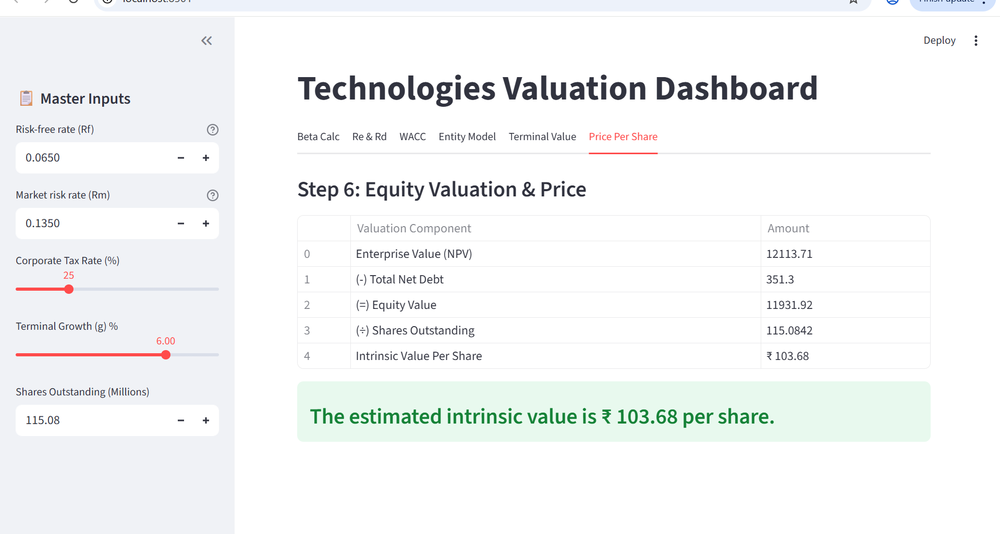
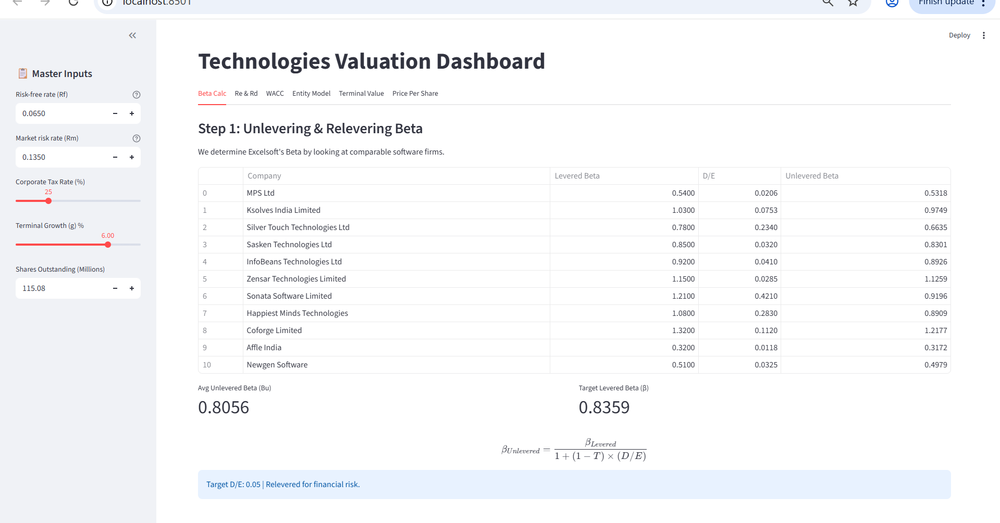
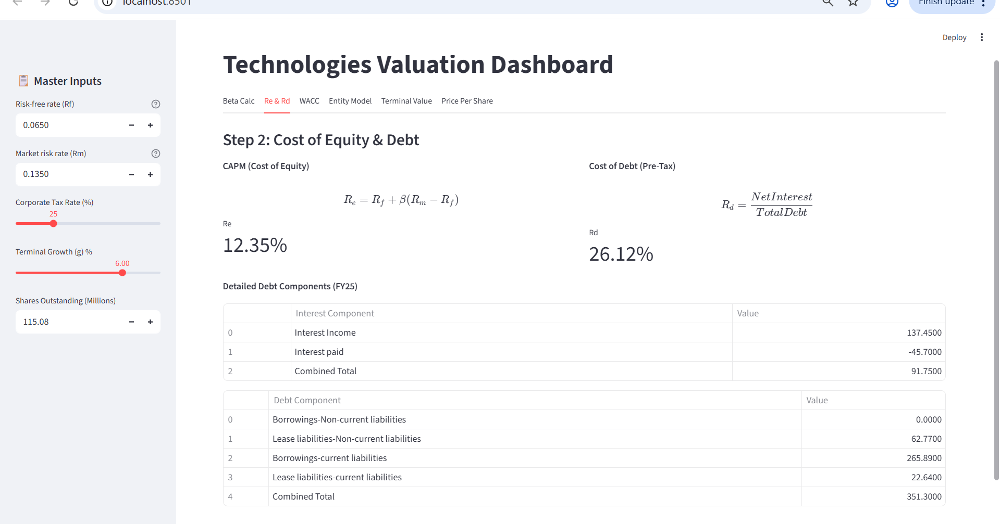
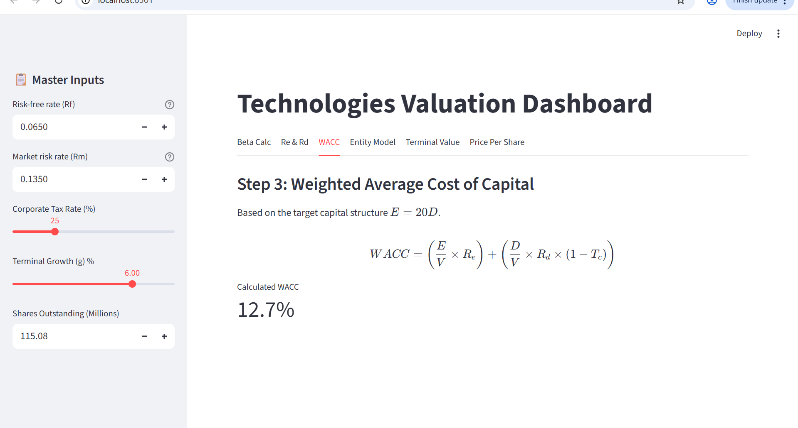
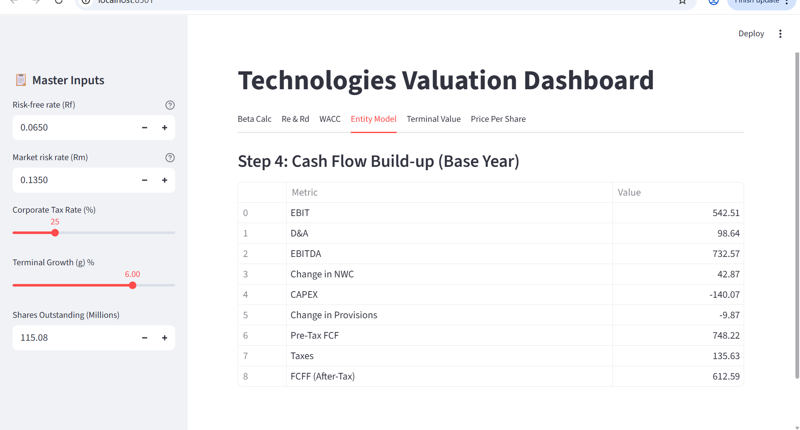
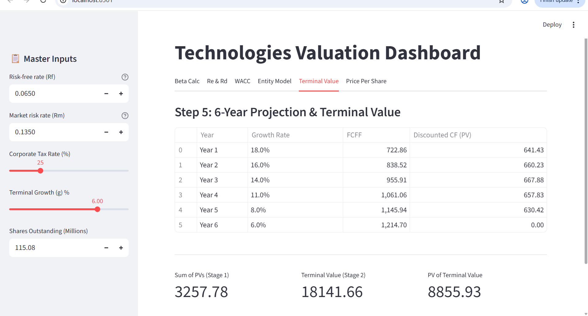

# Excelsoft Technologies IPO — DCF Valuation

A discounted cash flow valuation of Excelsoft Technologies Limited, prepared ahead of its
November 2025 listing on the NSE and BSE. Includes an interactive Streamlit dashboard where
each input can be adjusted and the valuation recomputed live.

**[Live dashboard →](https://excelsoft-dcf-valuation.streamlit.app)**



## Context

Coursework for the Financial Management module, MBA programme, FOM University of Applied
Sciences, Munich. Co-authored with [Shashank Prasanna Reddy](https://www.linkedin.com/in/shashank-reddy-642351120/).

The brief: value the company from its prospectus and issue a recommendation on the IPO at
the ₹120 offer price. Report date window 22–30 November 2025.

## Method

| Step | Approach |
|------|----------|
| Beta | Unlevered from 11 listed Indian IT and EdTech peers, relevered at target D/E |
| Cost of equity | CAPM — Rf 6.5%, market return 13.5%, levered beta 0.836 |
| Cost of debt | Derived from FY25 interest and debt components |
| WACC | Weighted at D/E of 0.05, 25% corporate tax |
| Cash flows | FCFF from EBIT, adjusted for D&A, change in NWC, net capex and provisions |
| Forecast | Six years at 18% / 16% / 14% / 11% / 8%, terminal growth 6% |
| Output | Enterprise value to equity value to intrinsic value per share |

## Result

| | |
|---|---|
| Levered beta | 0.836 |
| Cost of equity | 12.35% |
| Cost of debt | 26.12% |
| WACC | 12.70% |
| Base-year FCFF | ₹612.59M |
| Terminal value | ₹18,141.91M |
| Enterprise value | ₹12,113.88M |
| **Intrinsic value per share** | **₹103.68** |
| IPO offer price | ₹120.00 |

**Recommendation: tactical buy, but not at listing.** Wait one to two months for post-listing
volatility to clear, and for the first quarterly report to test the 18% growth assumption.

## Sensitivity

Intrinsic value per share across WACC and terminal growth:

| WACC (down) / g (across) | 5.0% | 6.0% | 7.0% |
|---|---|---|---|
| 11.7% | ₹116.42 | ₹138.25 | ₹168.10 |
| **12.7%** | ₹89.15 | **₹103.68** | ₹122.35 |
| 13.7% | ₹71.20 | ₹81.44 | ₹94.12 |

## Note on cost of debt

This repository contains the model as submitted, unaltered.

On review, the cost of debt calculation is worth flagging. It computes Rd as net interest
(interest income less interest paid) over total debt, giving 26.12%. Standard practice uses
interest expense alone, since interest income is a return on cash balances rather than a cost
of borrowing. On that basis Rd would be approximately 13%, WACC approximately 12.2%, and
intrinsic value approximately ₹112 per share.

The conclusion is unaffected — the ₹120 offer price sits above modelled intrinsic value either
way — but the input is documented here rather than amended, since this is the graded submission.

## Other limitations

- **Beta** is peer-derived, with no trading history for the company itself. Peer selection was
  judgement-based and the result is sensitive to it.
- **Terminal value** accounts for roughly 73% of enterprise value, so the output depends heavily
  on the 6% terminal growth assumption.
- **Forecast horizon** is six years with growth tapering from 18% to 8%, based on historical
  performance and sector digitisation trends rather than management guidance.

## What happened next

Listed 26 November 2025 at ₹135, a 12.5% premium on the offer price, following 43.19x
oversubscription. Intraday high ₹142.65, closing the first day at ₹125.95.

As of late July 2026 the stock traded near ₹77, against a 52-week high of ₹142.59 and a low
of ₹66.40.

FY26 total income rose 17% year-on-year and net profit 25% — close to the 18% growth this model
assumed for FY26. The decline reflected multiple compression rather than a shortfall in the
underlying business.

## Dashboard

<details>
<summary>All six steps</summary>

**Step 1 — Unlevering and relevering beta**


**Step 2 — Cost of equity and cost of debt**


**Step 3 — Weighted average cost of capital**


**Step 4 — Cash flow build-up**


**Step 5 — Six-year projection and terminal value**


**Step 6 — Equity valuation and price per share**


</details>

## Running locally

```bash
pip install -r dcf_app/requirements.txt
streamlit run dcf_app/dcf_tool.py
```

With Docker:

```bash
docker build -t excelsoft-dcf dcf_app/
docker run -p 8501:8501 excelsoft-dcf
```

## Contents

```
dcf_app/
  dcf_tool.py        Streamlit dashboard
  requirements.txt
  Dockerfile
Scripts/
  model.ipynb        Valuation workings
  extra.ipynb        Supporting calculations
docs/                Dashboard screenshots
```

## Disclaimer

Academic coursework, not investment advice. Figures are drawn from the company's public
prospectus and were current as at the report date.
